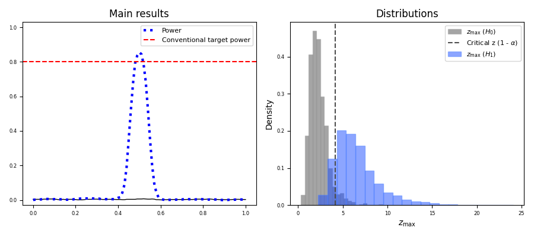

# Jiku Power1D - Exported results


Jiku Power1D exports results in the open-source [HDF5](https://www.hdfgroup.org/solutions/hdf5/) format.  

For example results see the attached file: `results.h5`


## Exported variables

| Variable     | Description                                                  |
| ------------ | ------------------------------------------------------------ |
| `alpha`      | Type I error rate                                            |
| `dt`         | total simulation duration (s)                                |
| `k`          | cluster extent (default 1);  clusters in the excursion set with smaller extents will be ignored when computing probabilities |
| `niters`     | number of simulation iterations (i.e., random data samples)  |
| `p_reject0`  | omnibus null rejection probability under H0 (alpha by defintion) |
| `p_reject1`  | omnibus null rejection probability under H1                  |
| `p1d_poi0`   | `(Q,)` domain-level (i.e., point-level) power under H0       |
| `p1d_poi1`   | `(Q,)` domain-level (i.e., point-level) power under H1       |
| `two_tailed` | two-tailed inference flag;  all analyses in Jiku Power1D v1.x are two-tailed |
| `z0`         | `(niters,)` distribution of zmax under H0                    |
| `z1`         | `(niters,)` distribution of zmax under H1                    |
| `zstar`      | critical threshold for H0 rejection                          |
| `Q`          | number of domain nodes (usually time nodes)                  |
| `Z0`         | `(niters,Q)` test statistic continua under H0 (null hypothesis) |
| `Z1`         | `(niters,Q)` test statistic continua under H1 (alternative hypothesis) |


## Code snippets

To read these data in Python:

```python
import numpy as np
import h5py

fpath = '/full/path/to/results.h5'

with h5py.File(fpath, 'r') as f:
    group = f['power1d']
    dt    = float( np.array( group['dt'] ) )  # total simulation duration (s)
    Z0    = np.array( group['Z0'] )   # (niters,Q) test statistic continua under H0
```


To read these data in MATLAB:

```matlab
fpath = '/full/path/to/results.h5';
dt    = hdf5read(fpath, '/power1d/dt');   % total simulation duration (s)
Z0    = hdf5read(fpath, '/power1d/Z0')';  % (niters,Q) test statistic continua under H0
```


## Full scripts

Refer to the attached full scripts: `read_results.py` and `read_results.m`

These scripts:

- read all results variables
- reproduce the figure below




